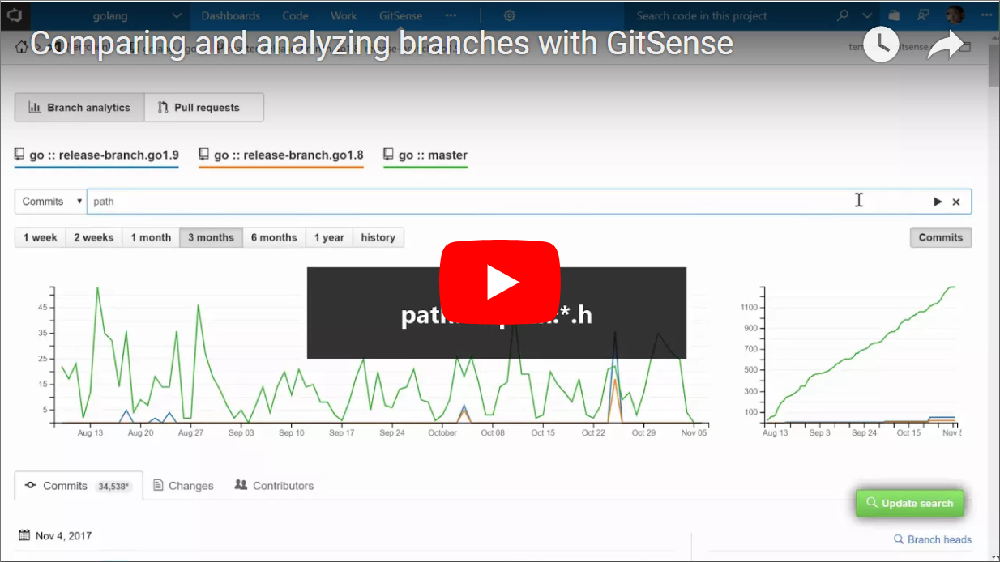

**[GitSense](https://gitsense.com)**, makes searching, analyzing, and reviewing code and code history in VSTS better.

With GitSense:

* You can search more than 5 branches per repository. With GitSense, you can search any branch, from any repository - in any combination.
* You can search for commits, by more than ids. You can search for commits by title, message, files changed, authors, and much more.
* You can instantly find code changes on any branch, from any repository, with a GitSense diffs search.
* You can search for pull requests, not only by creator, assignee and id.  You can search by files changed, code contributors, target branches, and more.
* You no longer have to jump around, to track and review commits and pull requests from different repositories.  With GitSense, you can review multiple repositories, branches, commits and pull requests, all at once.  

and a lot more. 

Developer or manager, Git novice or expert, GitSense can help you and your team, to work smarter and faster, together

## Search comparison

[Searching for commits, code, diffs and pull requests with GitSense, just makes sense](https://gitsense.com/index.html#compare-search)

## Quick example

Watch how easy it is to compare and analyze branches in VSTS with GitSense

## Develop smarter. Develop faster.

Get more done with smarter searches, better browsing and powerful GitSense analytics

### Search smarter

Search for code, commits, diffs, and pull requests on any branch, from any repository - in any combination.  With GitSense, you no longer have to question or double check search results for branch relevance.  With GitSense, you will always know.

* [Compare searching with and without GitSense](https://gitsense.com/index.html#compare-search)
* Try searching for [code](https://public.gitsense.com/insight/github?r=tensorflow/tensorflow#h%3Dgithub%26b%3Dgithub%3Atensorflow%2Ftensorflow%3Amaster%26q%3DTF_TensorData%5E_%5Ecs%3Atrue%5E_%5Elang%3Acpp%5E_%5Epath%3Atensorflow%2Fc%2F*%26t%3Dcode%26p%3Danalysis), [commits](https://public.gitsense.com/insight/github?r=Microsoft/vscode#b%3Dgithub%3AMicrosoft%2Fvscode%3Amaster%26q%3Dlang%3Ajavascript%5E_%5Elang%3Atypescript%26t%3Dcommits), and [diffs](https://public.gitsense.com/insight/github?r=vuejs/vue#b%3Dgithub%3Avuejs%2Fvue%3Adev%26q%3DgetFirstComponentChild%5E_%5Epath%3Asrc%2F*%26t%3Ddiffs) with GitSense

### Browse better

Browse efficiently and communicate more effectively, with advanced GitSense multi-browsing.  Browse and and share multiple repositories, branches, commits and pull/merge requests at once.  Working any other way, will seem antiquated, once you've tried multi-browsing with GitSense.

* Try browsing multiple [repositories](https://public.gitsense.com/insight/github?r=electron/electron::atom/atom::Microsoft/vscode), [branches](https://public.gitsense.com/insight/gitlab?r=gitlab-org/gitlab-ce::gitlab-org/gitlab-ee#b%3Dgitlab%3Agitlab-org%2Fgitlab-ce%3Amaster%3A%3Agitlab%3Agitlab-org%2Fgitlab-ee%3Amaster%26t%3Dcommits), [commits](https://public.gitsense.com/insight/github?r=rails/rails#b%3Dgithub%3Arails%2Frails%3Amaster%26q%3Dcommit%3A13c5aa818e%5E_%5Ecommit%3A65e08da68f%5E_%5Ecommit%3Aaa0865a8f0%26t%3Dchganalysis%26rg%3Dhistory) and [pulls](https://public.gitsense.com/insight/github?r=angular%2Fangular.js%3A%3Aangular%2Fangular#q%3Dpom%3A20196%5E_%5Epom%3A18879%5E_%5Epom%3A16192%5E_%5Estate%3Amerged%5E_%5Estate%3Aopen%26p%3Dipom) at once

### See more

Making sense of your codes history couldn't be easier.  Just point and click to compare and analyze changes across repositories, branches, commits and file revisions.  And for greater insight, execute an always relevant search, to help put changes into context.

* [Watch how easy it is to compare and analyze with GitSense](https://www.youtube.com/watch?v=a4Qu5wbVqfs)
* [Try it yourself](https://public.gitsense.com/insight/github?r=golang/go#b%3Dgithub%3Agolang%2Fgo%3Amaster%3A%3Agithub%3Agolang%2Fgo%3Arelease-branch.go1.9%3A%3Agithub%3Agolang%2Fgo%3Arelease-branch.go1.8%26t%3Dcommits)

## Review smarter. Review better, together

Speed up code reviews with always relevant searches, at the glance metrics, and more

**Search with confidence**

Always know the results returned by GitSense, will always be relevant to the code you are reviewing.

**Instant insights**

Quickly gauge code review effort, risk and progress, with at the glance code code churn metrics and more

**Divide and conquer**

Turn complex code reviews, into managable ones, with custom GitSense code review groups.

**Review better, together**

Quickly identify potential merge conflicts with other pull requests with the GitSense changes view.

**The bigger picture**

Logically group pull requests from the same, or different projects, to help you and others, to see the bigger picture.

